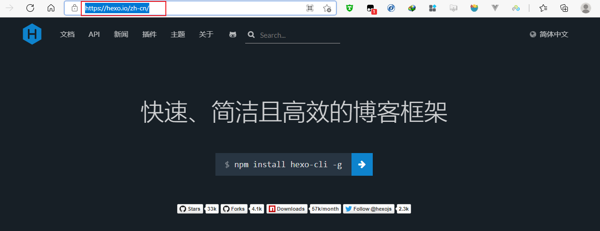
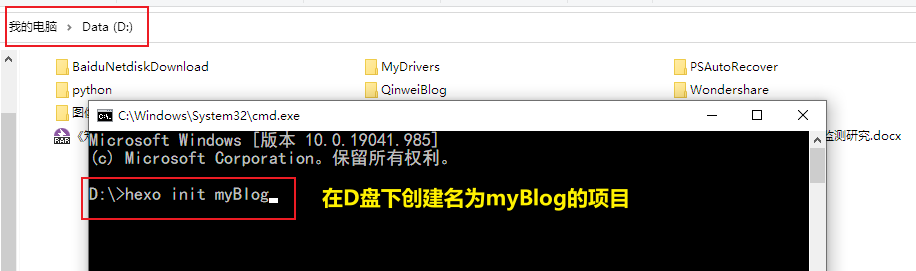

Welcome to [QW's Blog](https://qw-null.github.io/)!  &nbsp; This is my  first blog. 

## 搭建个人博客（基于hexo + github）
> 需要前期配置好git、npm（请自行百度 or B站）

### 1.Hexo 使用


#### 1.1下载

``` bash
npm install hexo-cli -g
```

#### 初始化（**需要到放置该项目的目录下运行**）

``` bash
hexo init [自己的博客文件夹名称]
```



> Tips: 【示例】 hexo init myBlog

```bash
cd blog
npm install
hexo server
```
博客可在本地查看【地址：http://localhost:4000】


### Generate static files

``` bash
$ hexo generate
```

More info: [Generating](https://hexo.io/docs/generating.html)

### Deploy to remote sites

``` bash
$ hexo deploy
```

More info: [Deployment](https://hexo.io/docs/one-command-deployment.html)
